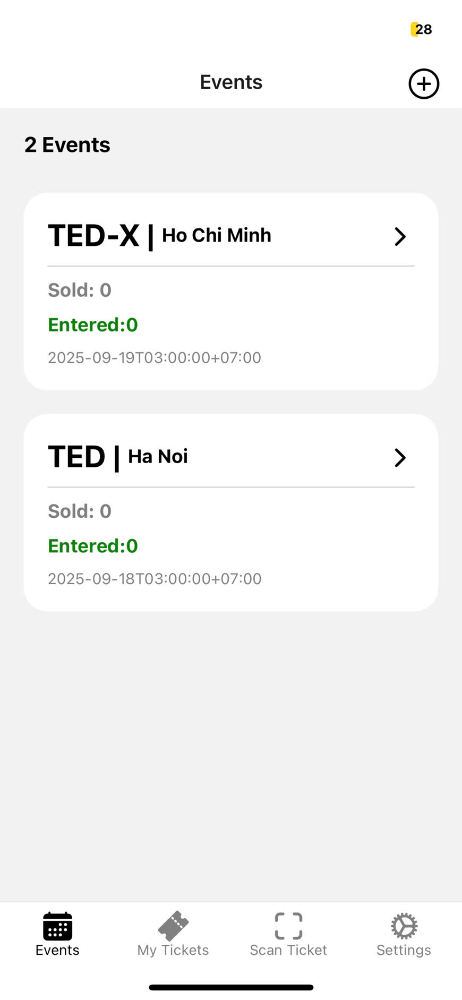
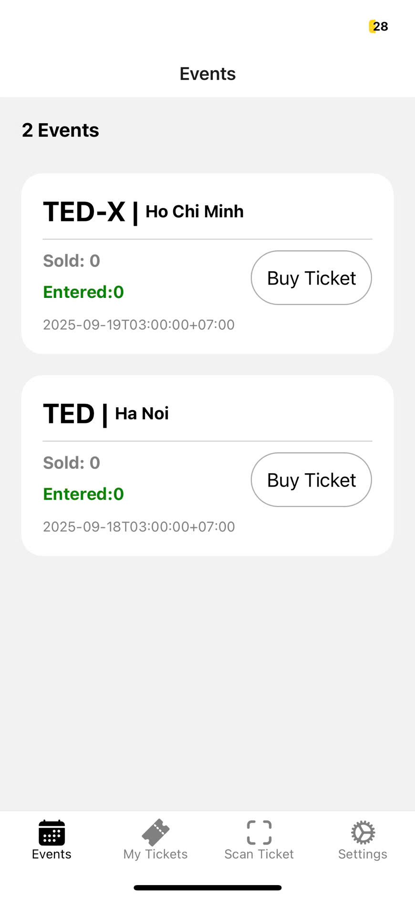
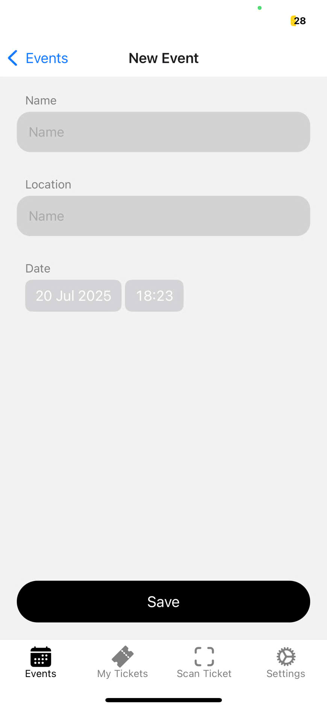
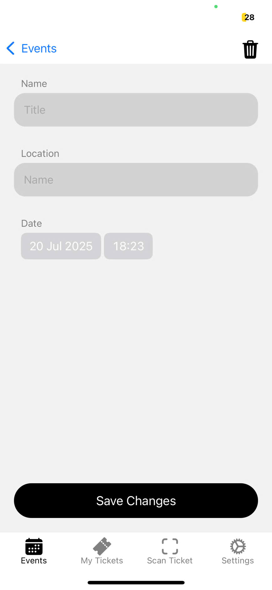
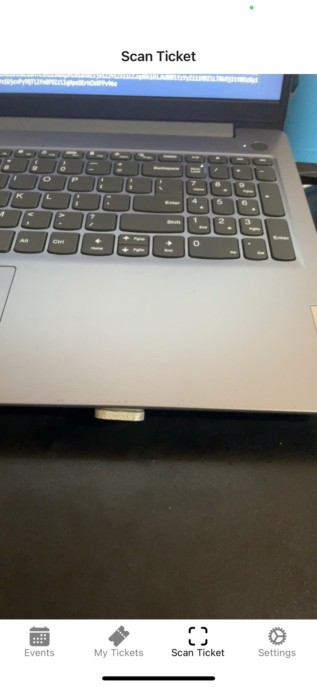
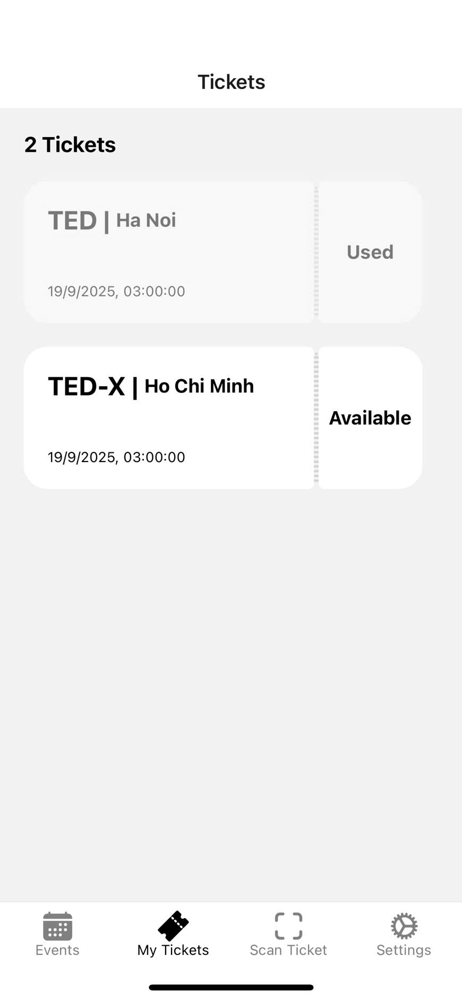
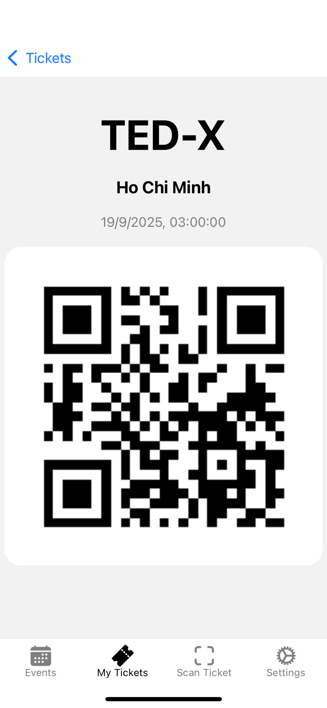

<h1 align="center">Gober</h1>
<div align="center">
  
</div>

<!-- TABLE OF CONTENTS -->
<details>
  <summary>Table of Contents</summary>
  <ol>
    <li>
      <a href="#about-the-project">About The Project</a>
      <ul>
        <li><a href="#built-with">Built With</a></li>
      </ul>
    </li>
    <li>
      <a href="#getting-started">Getting Started</a>
      <ul>
        <li><a href="#prerequisites">Prerequisites</a></li>
        <li><a href="#installation">Installation</a></li>
      </ul>
    </li>
    <li><a href="#roadmap">Roadmap</a></li>
    <li><a href="#license">License</a></li>
  </ol>
</details>


<!-- ABOUT THE PROJECT -->
## About The Project
Gober is a mobile application designed to manage events and tickets. It allows admin to create, update, and delete events, as well as manage check-ins.
Users can set the events they want to attend. The application is built using modern technologies and provides a user-friendly interface for both administrators and regular users.














### Built With


## Getting Started
This is an example of how you may give instructions on setting up your project locally. To get a local copy up and running follow these simple example steps.

### Prerequisites
- Go 1.20+
- Node.js 18+
- MySQL 8+
- Redis 7+
- gRPC
- Protobuf
- Docker (optional, for containerization)

### Installation
1. Clone the repo
   ```sh
   git clone https://github.com/upinmcSE/Gober.git
   ```
2. Navigate to the server directory and install dependencies
   ```sh
   cd Gober
   go mod tidy
   ```
3. Application configuration by file `config-ex.yaml`

4. Start the server
   ```sh
   cd Gober/cmd
   go run main.go
   ```

## Roadmap
- [x] Admin can create, update, and delete events
- [x] Admin can manage check-ins
- [x] Users can set events they want to attend
- [x] User can view their tickets
- [x] User can check-in to events
- [x] User can view event list
- [x] User can view ticket details
- [x] Admin can scan tickets using QR codes
- [ ] Better UI/UX improvements
- [ ] Add more features like notifications, event reminders, etc.

## License
[MIT](https://choosealicense.com/licenses/mit/)
